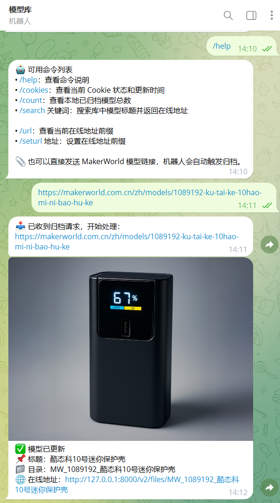
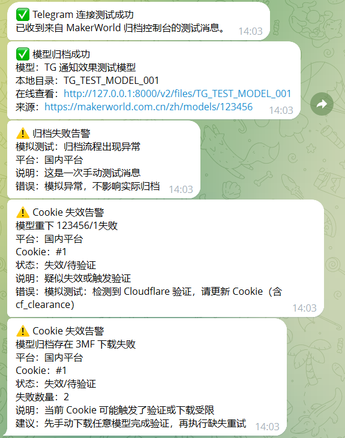

# [REQ-20260304-001] Telegram 推送与交互

- 状态：✅ 已完成
- 提出时间：2026-03-04
- 完成时间：2026-03-06
- 提出人：sonic
- 最后更新：2026-03-06
- 关联版本：v5.3

## 1. 用户需求记录（原始需求 + 初步思路）
- 需求描述：
  - 归档成功后推送结果。
    - 卡片形式推送模型信息和封面图
  - cookie 失效、限流、任务失败时告警。
  - 支持通过 Telegram 发送模型地址触发自动归档。
    - 通过正则匹配模型地址,直接调用后端接口归档
      - https://makerworld.com.cn/zh/models/*
      - https://makerworld.com/zh/models/*
- 用户初步实现思路：
  - 配置项：`bot_token`、`chat_id`、`enable_push`、`enable_command`
  - 消息模板区分成功/失败/cookie告警
  - 命令支持：发送模型链接、`/cookies`、`/count`
- 目标效果：
  - 配置后可稳定推送，并可通过机器人触发归档
- 配置页面添加 通知标签 用于配置tg相关参数,并保存到 config.json中
  - 必要参数配置,是否启用开关配置
  - 这个标签页开发的时候预留其他通知选项,比如企业微信等.只在代码预留,配置页不体现
- 单独py文件开发,留出接口,只在主程序判断是否启用tg通知后调用发送
- 约束/注意事项：
  - 命令权限控制（chat/user 白名单）
  - 避免敏感配置泄漏

## 2. AI 分析（难度 / 思路 / 改动范围）
- 实现难度：中
- 总体实现思路：
  - 增加 Telegram 配置管理与发送器模块
  - 在归档主流程与异常路径中统一触发通知
  - 新增命令入口，接入任务入队逻辑
  - 提前抽出统一通知分发层，避免后续新增企业微信等通知渠道时反复改业务层
- 预计改动模块：
  - `app/server.py`（配置 API、命令处理入口、通知分发）
  - `app/tg_push.py`（Telegram 专属推送与机器人能力）
  - `app/notify_dispatcher.py`（统一通知分发层）
  - 配置页前端（Telegram 参数管理）
- 主要风险点：
  - Telegram 网络波动导致阻塞
  - 命令入口滥用导致任务堆积
  - 若业务代码直接耦合 Telegram，后续增加其他通知渠道时改动面会扩大
- 验证方案：
  - 用测试 chat 验证成功/失败/异常三类消息
  - 命令触发一次归档并校验回执
  - 验证统一通知分发层不影响现有 Telegram 行为

## 3. AI 实现记录（实际落地）
- 实际改动文件：
  - `app/tg_push.py`
  - `app/notify_dispatcher.py`
  - `app/server.py`
  - `app/templates/config.html`
  - `app/config/config.json`
  - `.agents/dev_logic_map.md`
- 关键实现点：
  - 新增独立 Telegram 模块 `app/tg_push.py`，实现：
    - 归档成功推送（优先 `sendPhoto`，失败回退 `sendMessage`）
    - 告警推送（归档失败、Cookie 失效、Cookie 限流）
    - 命令轮询与交互（`/help`、`/cookies`、`/count`、`/search 关键词`、发送模型链接触发归档）
  - 新增统一通知分发层 `app/notify_dispatcher.py`：
    - 业务代码统一走 `notify_success / notify_alert / send_test_connection`
    - 当前已接入 Telegram
    - 后续增加企业微信等渠道时，只需注册到分发层，不需要改归档和下载业务逻辑
  - 后端接入通知配置：
    - `app/config/config.json` 增加 `notifications.telegram` 与 `notifications.wecom`（预留）
    - 新增 `GET /api/notify-config`、`POST /api/notify-config`
  - 配置页新增“通知”标签：
    - 支持 `enable_push`、`bot_token`、`chat_id`、`web_base_url` 保存
    - 提供“测试连接”能力
  - 推送规则已收敛：
    - `POST /api/archive` 成功后发送结果推送
    - 归档入口异常发送通用失败告警
    - Cookie 失效/限流只在真实模型下载失败相关链路触发
      - 初次归档出现 `missing_3mf`
      - 缺失 3MF 重试
      - 实例重下
      - 模型重下
    - Cookie 告警统一包含平台与 Cookie 序号
- 与预期差异：
  - 未做“任务队列化”，命令触发时仍走同一归档执行链路（已通过锁避免并发临时目录冲突）
  - 当前只有 Telegram 渠道真正实现，企业微信等仅完成配置结构与分发层预留
- 测试/验证结果：
  - 已完成代码联调与配置链路打通
  - 已通过真实 Telegram Bot API 发送模拟消息，验证以下模板可正常到达：
    - 连接测试
    - 成功归档通知
    - 通用归档失败告警
    - Cookie 失效告警
    - Cookie 限流告警
    - 首次归档出现 3MF 下载失败告警
- 后续待办：
  - 如后续引入企业微信，按 `NotificationDispatcher` 新增渠道服务并注册
  - 评估归档任务队列化（避免长任务阻塞）

## 关联信息
- 关联 Bug：-
- 关联文档：-
- 关联链接：-

## 实现预览

